# GitHub Actions Workflow Overview

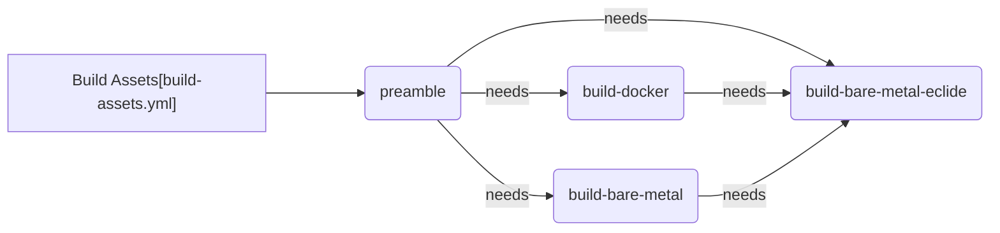

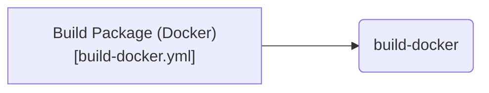

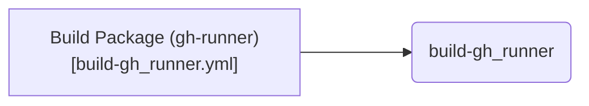

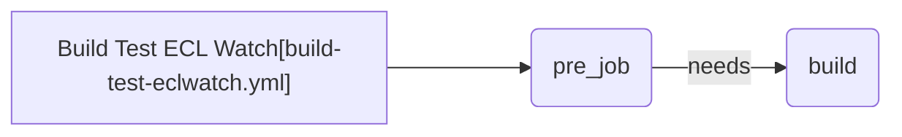

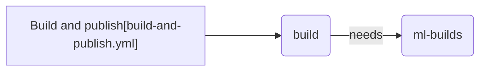

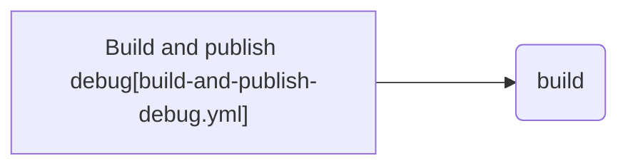

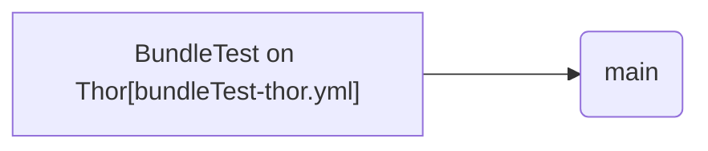

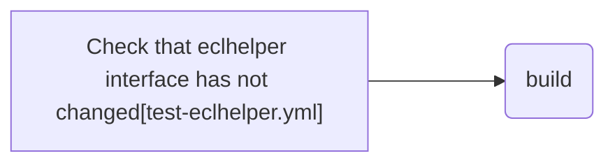

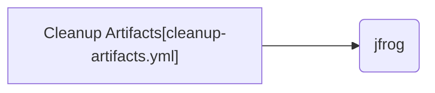

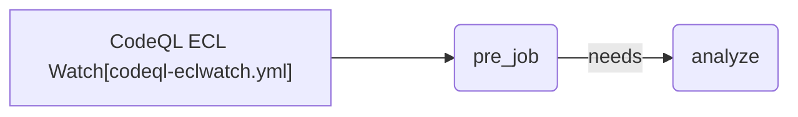

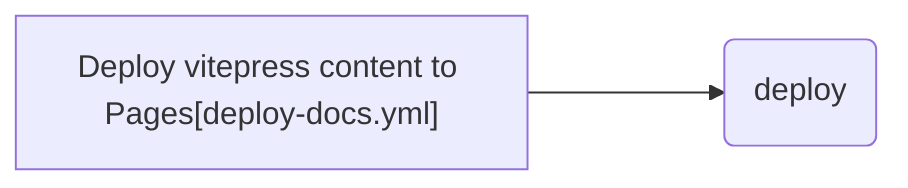

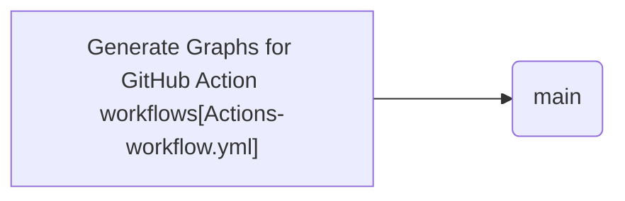

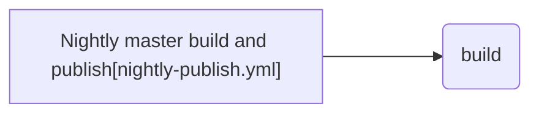

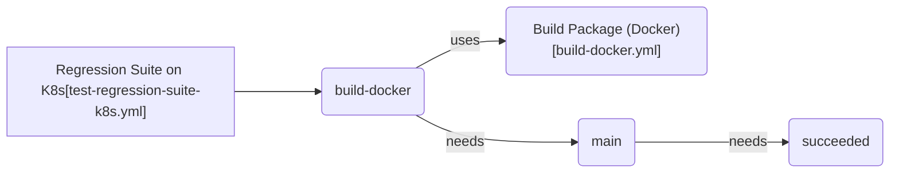

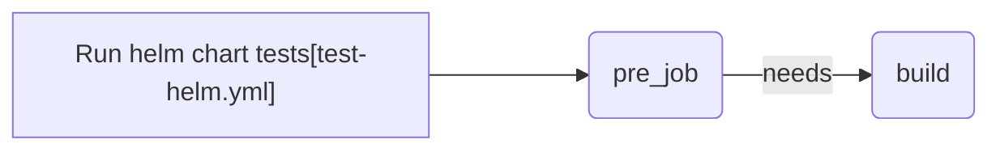

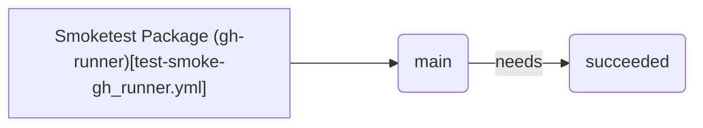

```mermaid

flowchart LR

  TEST_BUILD["Test Build[build-vcpkg.yml]"] ---> build-workflow-dispatch(build-workflow-dispatch)
  build-workflow-dispatch("build-workflow-dispatch
inputs:[os: ${{ inputs.os }},ln: ${{ inputs.ln }},upload-package: true,asset-name: docker-package]") --uses--> build-docker.yml("Build Package (Docker)[build-docker.yml]")
  build-workflow-dispatch(build-workflow-dispatch) --needs--> test-workflow-dispatch(test-workflow-dispatch)
  test-workflow-dispatch("test-workflow-dispatch
inputs:[os: ${{ inputs.os }},asset-name: docker-package]") --uses--> test-smoke-gh_runner.yml("Smoketest Package (gh-runner)[test-smoke-gh_runner.yml]")
  TEST_BUILD["Test Build[build-vcpkg.yml]"] ---> build-docker-ubuntu-24_04(build-docker-ubuntu-24_04)
  build-docker-ubuntu-24_04("build-docker-ubuntu-24_04
inputs:[os: ubuntu-24.04]") --uses--> build-docker.yml("Build Package (Docker)[build-docker.yml]")
  TEST_BUILD["Test Build[build-vcpkg.yml]"] ---> build-docker-ubuntu-22_04(build-docker-ubuntu-22_04)
  build-docker-ubuntu-22_04("build-docker-ubuntu-22_04
inputs:[os: ubuntu-22.04,upload-package: true,asset-name: docker-ubuntu-22_...]") --uses--> build-docker.yml("Build Package (Docker)[build-docker.yml]")
  build-docker-ubuntu-22_04(build-docker-ubuntu-22_04) --needs--> test-smoke-docker-ubuntu-22_04(test-smoke-docker-ubuntu-22_04)
  test-smoke-docker-ubuntu-22_04("test-smoke-docker-ubuntu-22_04
inputs:[os: ubuntu-22.04,asset-name: docker-ubuntu-22_...]") --uses--> test-smoke-gh_runner.yml("Smoketest Package (gh-runner)[test-smoke-gh_runner.yml]")
  TEST_BUILD["Test Build[build-vcpkg.yml]"] ---> test-regression-suite-k8s-ubuntu-22_04(test-regression-suite-k8s-ubuntu-22_04)
  test-regression-suite-k8s-ubuntu-22_04("test-regression-suite-k8s-ubuntu-22_04
inputs:[os: ubuntu-22.04,asset-name: docker-ubuntu-22_...]") --uses--> test-regression-suite-k8s.yml("Regression Suite on K8s[test-regression-suite-k8s.yml]")
  build-docker-ubuntu-22_04(build-docker-ubuntu-22_04) --needs--> test-unit-docker-ubuntu-22_04(test-unit-docker-ubuntu-22_04)
  test-unit-docker-ubuntu-22_04("test-unit-docker-ubuntu-22_04
inputs:[os: ubuntu-22.04,asset-name: docker-ubuntu-22_...]") --uses--> test-unit-gh_runner.yml("Unittest Package (gh-runner)[test-unit-gh_runner.yml]")
  build-docker-ubuntu-22_04(build-docker-ubuntu-22_04) --needs--> test-ui-docker-ubuntu-22_04(test-ui-docker-ubuntu-22_04)
  test-ui-docker-ubuntu-22_04("test-ui-docker-ubuntu-22_04
inputs:[os: ubuntu-22.04,asset-name: docker-ubuntu-22_...]") --uses--> test-ui-gh_runner.yml("UI test Package (gh-runner)[test-ui-gh_runner.yml]")
  build-docker-ubuntu-22_04(build-docker-ubuntu-22_04) --needs--> test-bundles-on-thor-ubuntu-22_04(test-bundles-on-thor-ubuntu-22_04)
  test-bundles-on-thor-ubuntu-22_04("test-bundles-on-thor-ubuntu-22_04
inputs:[os: ubuntu-22.04,asset-name: docker-ubuntu-22_...,generate-zap: ]") --uses--> bundleTest-thor.yml("BundleTest on Thor[bundleTest-thor.yml]")
  TEST_BUILD["Test Build[build-vcpkg.yml]"] ---> build-docker-ubuntu-20_04(build-docker-ubuntu-20_04)
  build-docker-ubuntu-20_04("build-docker-ubuntu-20_04
inputs:[os: ubuntu-20.04]") --uses--> build-docker.yml("Build Package (Docker)[build-docker.yml]")
  TEST_BUILD["Test Build[build-vcpkg.yml]"] ---> build-docker-rockylinux-8(build-docker-rockylinux-8)
  build-docker-rockylinux-8("build-docker-rockylinux-8
inputs:[os: rockylinux-8]") --uses--> build-docker.yml("Build Package (Docker)[build-docker.yml]")
  TEST_BUILD["Test Build[build-vcpkg.yml]"] ---> build-gh_runner-ubuntu-22_04(build-gh_runner-ubuntu-22_04)
  build-gh_runner-ubuntu-22_04("build-gh_runner-ubuntu-22_04
inputs:[os: ubuntu-22.04]") --uses--> build-gh_runner.yml("Build Package (gh-runner)[build-gh_runner.yml]")
  TEST_BUILD["Test Build[build-vcpkg.yml]"] ---> build-gh_runner-ubuntu-20_04(build-gh_runner-ubuntu-20_04)
  build-gh_runner-ubuntu-20_04("build-gh_runner-ubuntu-20_04
inputs:[os: ubuntu-20.04]") --uses--> build-gh_runner.yml("Build Package (gh-runner)[build-gh_runner.yml]")
  TEST_BUILD["Test Build[build-vcpkg.yml]"] ---> build-gh_runner-windows-2022(build-gh_runner-windows-2022)
  build-gh_runner-windows-2022("build-gh_runner-windows-2022
inputs:[os: windows-2022,cmake-configuration-ex: -T ho...]") --uses--> build-gh_runner.yml("Build Package (gh-runner)[build-gh_runner.yml]")
  TEST_BUILD["Test Build[build-vcpkg.yml]"] ---> build-gh_runner-windows-2019(build-gh_runner-windows-2019)
  build-gh_runner-windows-2019("build-gh_runner-windows-2019
inputs:[os: windows-2019,cmake-configuration-ex: -T ho...]") --uses--> build-gh_runner.yml("Build Package (gh-runner)[build-gh_runner.yml]")
  TEST_BUILD["Test Build[build-vcpkg.yml]"] ---> build-gh_runner-macos-13(build-gh_runner-macos-13)
  build-gh_runner-macos-13("build-gh_runner-macos-13
inputs:[os: macos-13,build-type: Release,cmake-configuration-ex: -DUSE...]") --uses--> build-gh_runner.yml("Build Package (gh-runner)[build-gh_runner.yml]")
  TEST_BUILD["Test Build[build-vcpkg.yml]"] ---> build-gh_runner-macos-12(build-gh_runner-macos-12)
  build-gh_runner-macos-12("build-gh_runner-macos-12
inputs:[os: macos-12,build-type: Release,cmake-configuration-ex: -DUSE...]") --uses--> build-gh_runner.yml("Build Package (gh-runner)[build-gh_runner.yml]")

```

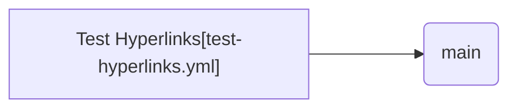

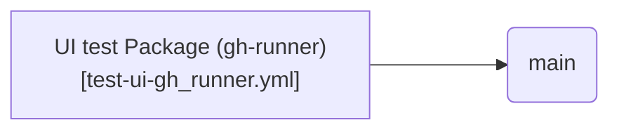

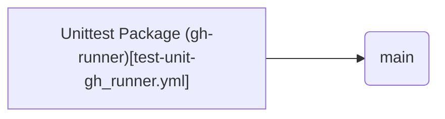

```mermaid

flowchart LR

  JIRABOT["jirabot[jirabot.yml]"] ---> jirabot(jirabot)

```

## GitHub Actions Trigger Overview

```mermaid

flowchart TB

  subgraph PULL_REQUEST
    pull_request ---> build-test-eclwatch.yml["Build Test ECL Watch[build-test-eclwatch.yml]"]
    pull_request ---> test-eclhelper.yml["Check that eclhelper interface has not changed[test-eclhelper.yml]"]
    pull_request ---> codeql-eclwatch.yml["CodeQL ECL Watch[codeql-eclwatch.yml]"]
    pull_request ---> Actions-workflow.yml["Generate Graphs for GitHub Action workflows[Actions-workflow.yml]"]
    pull_request ---> test-helm.yml["Run helm chart tests[test-helm.yml]"]
    pull_request ---> build-vcpkg.yml["Test Build[build-vcpkg.yml]"]
    pull_request ---> test-hyperlinks.yml["Test Hyperlinks[test-hyperlinks.yml]"]
  end

```

```mermaid

flowchart TB

  subgraph PULL_REQUEST_TARGET
    pull_request_target ---> jirabot.yml["jirabot[jirabot.yml]"]
  end

```

```mermaid

flowchart TB

  subgraph PUSH
    push ---> build-assets.yml["Build Assets[build-assets.yml]"]
    push ---> build-and-publish.yml["Build and publish[build-and-publish.yml]"]
    push ---> build-and-publish-debug.yml["Build and publish debug[build-and-publish-debug.yml]"]
    push ---> codeql-eclwatch.yml["CodeQL ECL Watch[codeql-eclwatch.yml]"]
    push ---> deploy-docs.yml["Deploy vitepress content to Pages[deploy-docs.yml]"]
    push ---> Actions-workflow.yml["Generate Graphs for GitHub Action workflows[Actions-workflow.yml]"]
    push ---> test-helm.yml["Run helm chart tests[test-helm.yml]"]
  end

```

```mermaid

flowchart TB

  subgraph SCHEDULE
    schedule ---> cleanup-artifacts.yml["Cleanup Artifacts[cleanup-artifacts.yml]"]
    schedule ---> codeql-eclwatch.yml["CodeQL ECL Watch[codeql-eclwatch.yml]"]
    schedule ---> nightly-publish.yml["Nightly master build and publish[nightly-publish.yml]"]
    schedule ---> build-vcpkg.yml["Test Build[build-vcpkg.yml]"]
  end

```

```mermaid

flowchart TB

  subgraph WORKFLOW_CALL
    workflow_call ---> build-docker.yml["Build Package (Docker)[build-docker.yml]"]
    workflow_call ---> build-gh_runner.yml["Build Package (gh-runner)[build-gh_runner.yml]"]
    workflow_call ---> bundleTest-thor.yml["BundleTest on Thor[bundleTest-thor.yml]"]
    workflow_call ---> test-regression-suite-k8s.yml["Regression Suite on K8s[test-regression-suite-k8s.yml]"]
    workflow_call ---> test-smoke-gh_runner.yml["Smoketest Package (gh-runner)[test-smoke-gh_runner.yml]"]
    workflow_call ---> test-ui-gh_runner.yml["UI test Package (gh-runner)[test-ui-gh_runner.yml]"]
    workflow_call ---> test-unit-gh_runner.yml["Unittest Package (gh-runner)[test-unit-gh_runner.yml]"]
  end

```

```mermaid

flowchart TB

  subgraph WORKFLOW_DISPATCH
    workflow_dispatch ---> deploy-docs.yml["Deploy vitepress content to Pages[deploy-docs.yml]"]
    workflow_dispatch ---> Actions-workflow.yml["Generate Graphs for GitHub Action workflows[Actions-workflow.yml]"]
    workflow_dispatch ---> build-vcpkg.yml["Test Build[build-vcpkg.yml]"]
    workflow_dispatch ---> test-hyperlinks.yml["Test Hyperlinks[test-hyperlinks.yml]"]
  end

```