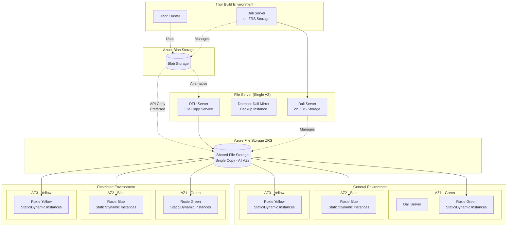

This document outlines the best practices for deploying a roxie that uses remote storage.

# FileRoxie/FilePuller/FileServer

There should be a "File Roxie" for each copy of the data that is being kept.  The recommendation is to use a single-copy of the data using azure file ZRS storage.  This means that the data is automatically available from any availability zone, and can be shared by all clusters that use that data.

Data is deployed to the roxie system by deploying a package map with the --dfu-copy option to use dfuserver to copy the data.

It is strongly recommended to configure the system to use the azure api to copy the files
* You do not need to configure and run dafilesrv instances (either on demand or up all the time)
* It should be more efficient and quicker (verification needed)
* This requires the data to be pulled directly from blob storage - so it should be pulled direct from thor, rather than from another roxie.

If api copying is not possible then one of the following will be required:
* dafilesrv instances to spray data.  Ideally these would be auto-scaled.
* a classic pull roxie.  The last resort - since the cost of standing one up is high.

NOTE: This means that the FileServer dali is running in a single availability zone and is a single point of failure.  The dali store should be on ZRS, and there should be a dormant mirror instance ready to start on demand to cover the case where an AZ goes down.

# Deploying environments

There should be a roxie environment for each set of roxie clusters that will be updated independently.  For instance, if you had two classes of environments - general and restricted - each with multiple replicas - green, blue and yellow instances in different AZs then you would have 6 independent environments:

general green, general blue, general yellow, restricted green, restricted blue, restricted yellow

## Architecture Diagram

**Key Points:**
- All Roxie instances share the same ZRS file storage (no duplication)
- Each environment (General/Restricted) updates independently
- Each color (Green/Blue/Yellow) represents a separate availability zone
- File Server Dali is a single point of failure, mitigated by dormant mirror

Each of these environments is configured to pull the files from the FileServer, but share the target location so no files are actually copied when packages are deployed.  ?Should queries avoid copying?

If there are any static roxie instances that are always available they will be defined in the environment in the classic way.  Dynamic instances need a different treatment.  The configuration will be included, but they will be defined to have 0 replicas in K8s, and no RoxieServer instances in the bare-metal configuration.

## Spinning up new instances.

The current roxie configuration does not lend itself well to individually-identifiable dynamically scaled roxies.  The configurations tend to be static.  Kubernetes can scale by increasing the number of replicas, but that will increase the number of instances behind a load balancer, rather than creating uniquely identifiable instances.  That may be the desired approach some of the time...

### K8s

Add a new roxieinstance section to the helm chart.  It should contain a name that is used to make the service-endpoints unique, and the name of the roxie configuration that is being used as the base.

A better solution would be to allow an independent child helm chart to be deployed to create a roxie instance.  This should be discussed.

### Bare metal

Take an existing environment.xml.  Add RoxieServerProcess instances to match the configuration being scaled up.  Deploy the environment.xml to the nodes that are being used and start the system.

# Configuring query priorities and caches

More information to be included here later..