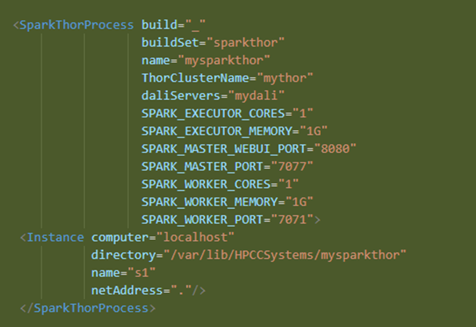

# HPCC : How to Remove the Spark-HPCC Connector Integration

Once you install the newer platform on all your nodes, the deprecated Spark plugin will have been removed. However, the installer does not modify your existing `environment.xml` file. So, you'll need to edit it to remove the Spark integration portions.

1. Make sure your platform is not running.
2. Locate your `environment.xml` file in the `/etc/HPCCSystems` folder.
3. Make a backup copy of the file for safekeeping.
4. Open the file in the editor of your choice (e.g., VS Code).
5. Remove the following two sections:

   

   And

   

6. Save the file.
7. Copy the edited `environment.xml` to all nodes.

When you restart your platform, you should no longer see a SparkThor component.
