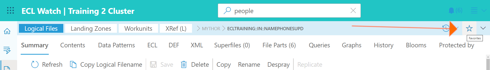
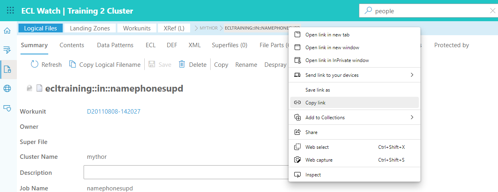
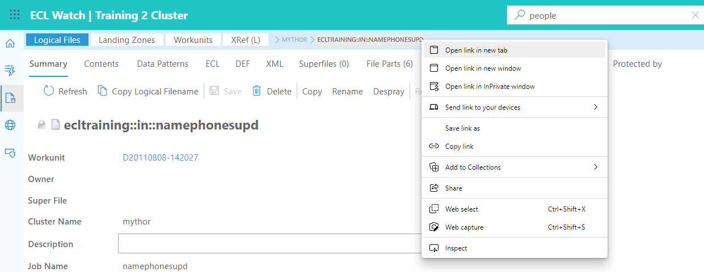

# ECL Watch Breadcrumbs and Navigation

ECL Watch now uses standard Web page URLs and each time you drill down into a section (such as Workunit details) a series of **breadcrumbs** are displayed. This allows you to navigate easily to any place along the trail. You can also use the Forward and Back buttons on your browser and copy the URL of any displayed page from the browser’s address bar to send to a colleague via email or text message.

---

## How to bookmark pages

---

## How to right click any link and copy the URL

---

## How to right click any link and use "open in new tab/window"

---

## Learn more about

- [Technical Preview Switch](ECL-Watch-Technical-Preview-Feature.md)
- [History and Favorites icons](ECL-Watch-History-and-Favorites-icons.md)
- [New Side Toolbar](ECL-Watch-New-Side-Toolbar.md)
- [Universal Search](ECL-Watch-Universal-Search.md)
- [Breadcrumbs and Navigation](ECL-Watch-Breadcrumbs-and-Navigation.md)
- [Light Mode and Dark Mode](ECL-Watch-Light-Mode-and-Dark-Mode.md)
- [File Cost and File Access cost](ECL-Watch-File-Cost-and-File-Access-Cost.md)
