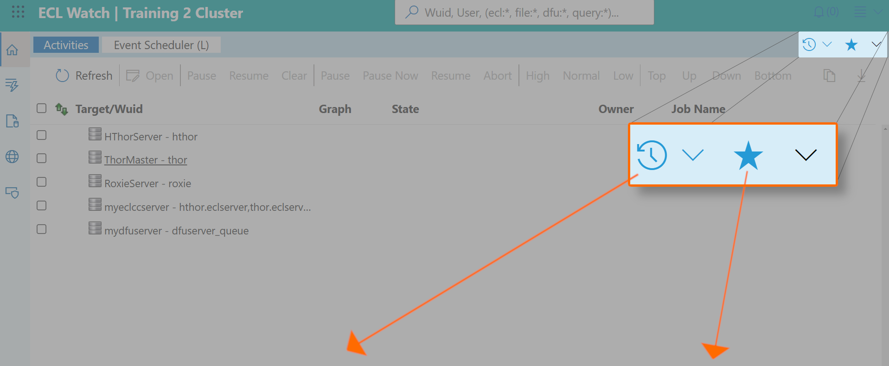

# ECL Watch History and Favorites icons

On the top right side, notice the new buttons and drop-lists.

| From the **History** drop-list, you can quickly navigate to a page you have visited recently.| The **Favorites** icon (the star) allows you to mark any page as a favorite. Clicking on the Star icon toggles its state. From the **Favorites** drop-list, you can quickly navigate to a page you have marked as a Favorite. |
|:---|---:|

---

## Learn more about

- [Technical Preview Switch](ECL-Watch-Technical-Preview-Feature.md)
- [History and Favorites icons](ECL-Watch-History-and-Favorites-icons.md)
- [New Side Toolbar](ECL-Watch-New-Side-Toolbar.md)
- [Universal Search](ECL-Watch-Universal-Search.md)
- [Breadcrumbs and Navigation](ECL-Watch-Breadcrumbs-and-Navigation.md)
- [Light Mode and Dark Mode](ECL-Watch-Light-Mode-and-Dark-Mode.md)
- [File Cost and File Access cost](ECL-Watch-File-Cost-and-File-Access-Cost.md)
