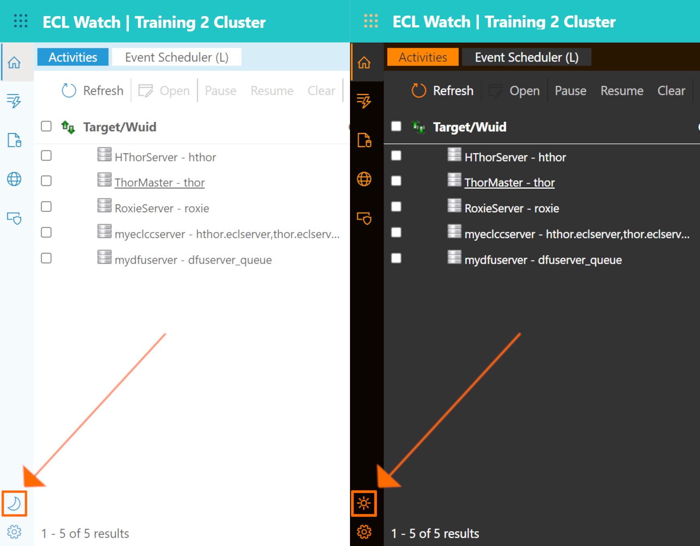

# ECL Watch Light Mode and Dark Mode

A button on the lower left toggles between Dark Mode and Light Mode. This allows you to choose your preference and easily switch at any time.

---

## Learn more about

- [Technical Preview Switch](ECL-Watch-Technical-Preview-Feature.md)
- [History and Favorites icons](ECL-Watch-History-and-Favorites-icons.md)
- [New Side Toolbar](ECL-Watch-New-Side-Toolbar.md)
- [Universal Search](ECL-Watch-Universal-Search.md)
- [Breadcrumbs and Navigation](ECL-Watch-Breadcrumbs-and-Navigation.md)
- [Light Mode and Dark Mode](ECL-Watch-Light-Mode-and-Dark-Mode.md)
- [File Cost and File Access cost](ECL-Watch-File-Cost-and-File-Access-Cost.md)
