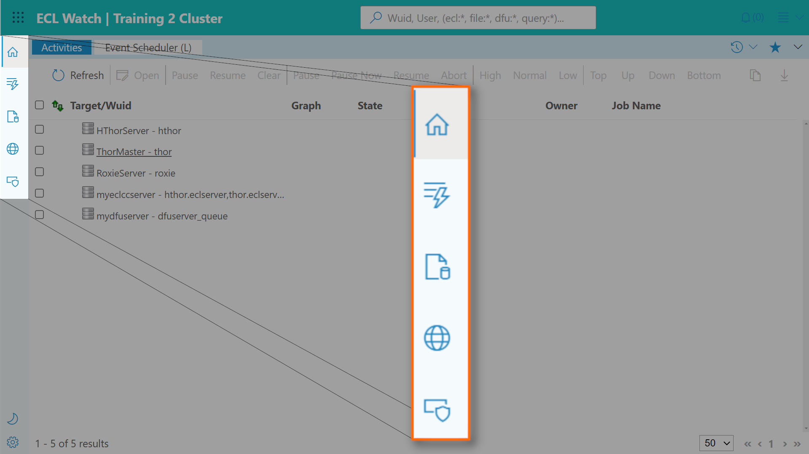

# ECL Watch New Side Toolbar

While the sections of ECL Watch have not changed, the toolbar to access them is now located on the left side and the icons for each section have been updated.

While the display presentation has been updated to provide a cleaner view, the contents are nearly identical to the previous version of ECL Watch.

---

## Sections in the Toolbar

- Activity
- Event Scheduler
- Search Results

- ECL Workunits
- ECL Playground

- Logical Files
- Landing Zones
- DFU Workunits
- XRef

- Published Queries
- Package Maps

- Topology
- Disk Usage
- Target Clusters
- Cluster Processes
- System Servers
- Security
- Monitoring
- Dynamic ESDL  
    *Note: This section is likely to change and may behave differently in containerized versions.*

---

## Learn more about

- [Technical Preview Switch](ECL-Watch-Technical-Preview-Feature.md)
- [History and Favorites icons](ECL-Watch-History-and-Favorites-icons.md)
- [New Side Toolbar](ECL-Watch-New-Side-Toolbar.md)
- [Universal Search](ECL-Watch-Universal-Search.md)
- [Breadcrumbs and Navigation](ECL-Watch-Breadcrumbs-and-Navigation.md)
- [Light Mode and Dark Mode](ECL-Watch-Light-Mode-and-Dark-Mode.md)
- [File Cost and File Access cost](ECL-Watch-File-Cost-and-File-Access-Cost.md)
