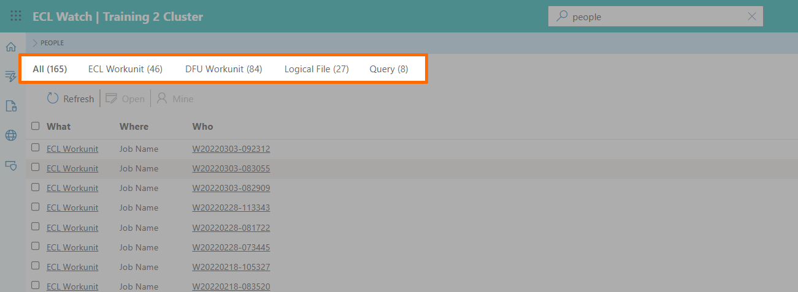

# ECL Watch Universal Search

At the top of the page, there is a global search facility allowing you to search for anything within the ECL Watch interface. This is similar to the global search in previous versions, but includes a number of usability improvements.

You can search for any of the following:

- Workunit ID (WUID)
- User
- File
- DFU workunit
- Query
- or even ECL code within a workunit

The results are sorted by type and each result is clickable, allowing you to drill down for more details. The first tab shows **All results**. Other tabs each show only one type based on your search criteria, such as **ECL Workunit**, **DFU Workunit**, **Logical File**, and **Query**.

---

## Learn more about

- [Technical Preview Switch](ECL-Watch-Technical-Preview-Feature.md)
- [History and Favorites icons](ECL-Watch-History-and-Favorites-icons.md)
- [New Side Toolbar](ECL-Watch-New-Side-Toolbar.md)
- [Universal Search](ECL-Watch-Universal-Search.md)
- [Breadcrumbs and Navigation](ECL-Watch-Breadcrumbs-and-Navigation.md)
- [Light Mode and Dark Mode](ECL-Watch-Light-Mode-and-Dark-Mode.md)
- [File Cost and File Access cost](ECL-Watch-File-Cost-and-File-Access-Cost.md)
