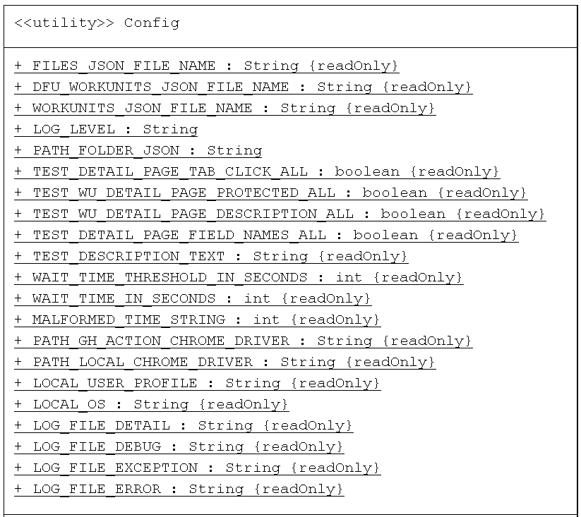

**The Class Design and Code Flow for ECL Watch Test Suite**

**1. TestRunner.java**

The TestRunner class is responsible for setting up and executing automated tests using the TestNG framework in a
Selenium-based testing environment. It initializes the WebDriver, loads test classes, configures logging, and runs the
tests.

**Methods:**

1. main Method

The entry point of the application. It performs the following steps:

- Calls setupLogger to configure the logging system.
- Logs test execution details to a specified file.
- Calls setupWebDriver to initialize the WebDriver based on the environment (local or remote).
- Creates an instance of TestNG.
- Sets the test classes to be run by calling loadClasses.
- Adds a TestInjector listener to inject dependencies (logger and driver) into the tests.
- Runs the tests using TestNG.
- Quits the WebDriver session after the tests have completed.

2. setupWebDriver Method

Initializes and returns a WebDriver instance configured for headless Chrome operation:

- Configures ChromeDriver to run in headless mode, disables sandbox security, and sets log level to errors only.
- Suppresses logs generated by ChromeDriver.
- Checks if the tests are running locally using Common.isRunningOnLocal.
- If local, sets up the driver to connect to a local Selenium server.
- If not local, initializes a standard ChromeDriver.

3. loadClasses Method

Loads the test classes specified in TestClasses.testClassesList:

- Iterates over the testClassesList and loads each class by its fully qualified name.
- Adds the loaded class to the list classes.
- Catches and prints any ClassNotFoundException.

4. setupLogger Method

Configures the logger for logging test execution details:

- Creates a logger for TestRunner.
- Sets up a FileHandler to log messages to a file specified by Config.LOG_FILE.
- Uses a SimpleFormatter to format the log messages.
- Adds the handler to the logger and sets the log level to ALL.
- Catches and prints any IOException.
- Turns off all logging from the Selenium WebDriver to reduce noise in the logs.

**2. TestClasses.java**

The TestClasses class in the framework.config package is responsible for maintaining
a list of test classes used in the framework. This class provides a centralized and
immutable collection of test class metadata, which includes the name of each test
class and its fully qualified class name. This setup helps organize and reference
the test classes easily throughout the testing framework. By using the TestClasses
class, the framework can dynamically load and execute tests, enhancing modularity
and maintainability.

**3. TestClass.java**

The TestClass class in the framework.model package is a simple model class designed
to encapsulate metadata about a test class within the testing framework. It contains
the name of the test class and its fully qualified class name (path). This class
provides a structured way to store and retrieve information about each test class,
which can be utilized by other components in the framework for dynamically loading and
executing tests.

**4. TestInjector.java**

The TestInjector class in the framework.setup package implements the
IInvokedMethodListener interface from TestNG. This class is designed to inject
dependencies (such as a logger and a WebDriver instance) into test methods before
they are invoked. It ensures that these dependencies are available to the tests when
they are executed. The TestInjector class provides a way to set up the necessary
environment for test execution by using holders to manage the logger and WebDriver
instances.

**Methods:**

1. constructor

An instance of TestInjector is created with a Logger and a WebDriver.

2. Before Invocation

- Before a test method is invoked, the beforeInvocation method is called.
- It checks if the method is a test method.
- If it is a test method, it sets the logger and driver instances in their respective holders.

3. After Invocation

- After a test method is invoked, the afterInvocation method is called.
- Currently, this method does not perform any actions but can be extended for cleanup operations.

**5. WebDriverHolder.java**

The WebDriverHolder class in the framework.setup package is a utility class designed to
manage a singleton instance of WebDriver. This class allows the framework to store and
access the WebDriver instance globally, ensuring that all test methods can utilize the
same driver instance. This class is used in the TestInjector class in the beforeInvocation() method.

**6. LoggerHolder.java**

The LoggerHolder class in the framework.setup package is a utility class designed to manage a
singleton instance of Logger. This class allows the framework to store and access the
Logger instance globally, ensuring that all test methods and other components can utilize
the same logger instance for consistent logging throughout the application. This class is
used in the TestInjector class in the beforeInvocation() method.

**7. Config.java**

The Config class in the framework.config package serves as a centralized configuration
repository for the application. It contains various constants that are used throughout
the framework, providing a single point of reference for configuration settings such as
file paths, IPs, and other constants. This approach enhances the maintainability and
readability of the code by avoiding hard-coded values scattered across different classes.

**8. Common.java**

The Common class in the framework.utility package provides a set of utility
methods that are frequently used throughout the testing framework. These
methods handle common tasks such as checking for text presence on a webpage,
opening a webpage, and determining the environment in which the code is
running (local or GitHub Actions). The class leverages constants from the
Config class to maintain consistency and facilitate configuration management.

**Methods:**

1. checkTextPresent Method

Checks if the specified text is present on the current webpage and logs the result.

- Retrieves the page source using driver.getPageSource().
- Checks if the page source contains the specified text.
- Logs a success message if the text is found; otherwise, logs an error message and records it using the provided
  logger.

2. openWebPage Method

Opens the specified URL in the browser and maximizes the window.

- Navigates to the specified URL using driver.get(url).
- Maximizes the browser window using driver.manage().window().maximize().
- Calls the sleep method to pause the execution for a short period to allow the page to load completely.

3. sleep Method

The sleep method pauses the execution of the program for a specified duration
(4 seconds in this case). This can be useful in scenarios where a delay is required,
such as waiting for a webpage to load completely before proceeding with further actions.

4. isRunningOnLocal Method

Determines if the code is running on a local environment.

- Checks if the operating system name starts with the value of Config.LOCAL_OS.
- Checks if the user profile path starts with the value of Config.LOCAL_USER_PROFILE.
- Returns true if both conditions are met, indicating a local environment; otherwise, returns false.

5. getUrl Method

Constructs the full URL based on the environment (local or GitHub Actions).

- Calls isRunningOnLocal to check the environment.
- If running locally, returns the URL prefixed with Config.LOCAL_IP.
- If running in GitHub Actions, returns the URL prefixed with Config.GITHUB_ACTION_IP.

**9. TimeUtils.java**

The TimeUtils class in the framework.utility package provides utility functions to handle
time strings and convert them into milliseconds. This is useful for standardizing time
representations and performing time-based calculations in a consistent manner.

TIME_PATTERN: A regular expression pattern used to match various time formats. The supported formats are:

- d days h:m:s.s
- h:m:s.s
- m:s.s
- s.s

**Methods:**

1. convertToMilliseconds Method

This method converts a time string into milliseconds based on the matched pattern. If the
time string does not match any recognized format, it returns a predefined constant for
malformed time strings.

- The method first attempts to match the input time string against the TIME_PATTERN.
- If the string matches the pattern, it initializes the time components (days, hours, minutes, seconds, milliseconds) to
  zero.
- The method then extracts values based on the matching groups.
- If any parsing errors occur (e.g., NumberFormatException) or if the string does not match the pattern, the method
  returns Config.MALFORMED_TIME_STRING.
- If the parsing is successful, the method calculates the total duration in milliseconds

**10. NavigationWebElement**

This NavigationWebElement class in the framework.model package, is a record class used to represent a navigation element
within a web application framework. It offers a concise way to store and manage information about such
elements.

- The class is defined as a record which is a recent addition to Java that simplifies creating immutable data classes.
- It has three properties:
    - name: A String representing the name or identifier of the navigation element in the menu bar(e.g., "Activities", "
      ECL", "Files).
    - hrefValue: A String representing the href attribute value of the element, which typically specifies the URL linked
      to by the element.
    - webElement: A WebElement object from the Selenium library. This holds the actual WebElement instance representing
      the element in the web page.

- Due to the record nature, a constructor is not explicitly defined. The compiler generates a constructor that takes
  arguments for each property and initializes them.
- The NavigationWebElement class offers a structured way to manage data related to navigation elements in a web
  application framework.

**11. Java Classes for Representing Workunit JSON Data**

This section details the class structure used to map JSON data file of list of "Workunit"
entities into Java objects. These classes provide a clear representation of the data and
allow for easy access to its values throughout the codebase. This structure is particularly
beneficial for writing test cases, as it simplifies working with the data in a well-defined
format. Below are the UML diagram of the classes used for JSON mapping to java objects for
workunits JSON file.

**12. ActivitiesTest**

This ActivitiesTest class in the framework.pages package, implements a TestNG test (@Test)
for the Activities page of ECL Watch UI. It focuses on verifying the following aspects of the
Activities page:

- Presence of specific text elements
- Functionality of navigation links and their corresponding sub-tabs

**Class Variables:**

- textArray: A static final String array containing expected text elements to be present on the Activities page (e.g., "
  Target/Wuid", "Graph").
- navNamesArray: A static final String array containing names used to locate the navigation link WebElements on the
  Activities page (e.g., "Activities", "ECL", "Files).
- tabsListMap: A static final Map that defines the expected sub-tabs for each navigation link. The key is the navigation
  link name, and the value is a List of expected sub-tabs.

**Methods:**

1. testActivitiesPage (Test Method)

- Obtains the WebDriver instance (WebDriverHolder.getDriver()).
- Opens the Activities page using the URL from Config.ACTIVITIES_URL and Common.openWebPage.
- Retrieves a Logger instance for logging test results (LoggerHolder.getLogger()).
- Calls testForAllText to verify the presence of expected text elements on the page.
- Calls getNavWebElements to retrieve a list of NavigationWebElement objects representing navigation links.
- Calls testForNavigationLinks to verify the functionality of navigation links.

2. testForAllText Method

- Iterates through the textArray.
- For each text element, calls Common.checkTextPresent to check its presence on the Activities page using the provided
  WebDriver, text element, page name ("Activities Page"), and Logger instance.

3. testForNavigationLinks Method

- Takes the WebDriver instance, a list of NavigationWebElement objects, and a Logger instance as arguments.
- Iterates through the list of NavigationWebElement objects:
    - Clicks on the WebElement using the webElement().click() method.
    - Calls testTabsForNavigationLinks to verify if the expected sub-tabs are present for the clicked link.
    - Logs success/failure messages based on the verification result using the Logger instance.

4. getCurrentPage Method

- Iterates through the tabsListMap.
- For each entry (navigation link name and its corresponding sub-tabs):
    - Checks if all sub-tabs from the list are present in the current page source using driver.getPageSource().
    - If all sub-tabs are found, returns the navigation link name (current page).
- If no matching navigation link is found, returns "Invalid Page".

5. testTabsForNavigationLinks Method:

- Takes the WebDriver instance and a NavigationWebElement object as arguments.
- Retrieves the expected sub-tabs list for the navigation element from tabsListMap.
- Gets the current page source using driver.getPageSource().
- Iterates through the expected sub-tabs list:
    - Checks if each sub-tab is present in the page source.
    - If any sub-tab is missing, returns false.
- If all sub-tabs are found, returns true.

6. getNavWebElements Method:

- Creates an empty list to store NavigationWebElement objects.
- Iterates through the navNamesArray.
- For each navigation link name:
    - Finds the WebElement using driver.findElement with By.name strategy.
    - Extracts the href attribute value.
    - Creates a new NavigationWebElement object with the name, href value, and WebElement reference.
    - Adds the NavigationWebElement to the list.
- Returns the list of NavigationWebElement objects.

**13. BaseTableTest**

This abstract class, `BaseTableTest`, in the framework.pages package, provides a framework for
testing web pages that display tabular data. It defines methods for common functionalities like:

- Verifying the presence of expected text elements on the page.
- Comparing the content displayed in the table with corresponding data from a JSON file.
- Testing the sorting functionality of the table columns.
- Verifying links within the table cells and their navigation behavior.

**Abstract Methods:**

1. `getPageName`: Returns the name of the page under test.
2. `getPageUrl`: Returns the URL of the page under test.
3. `getJsonFilePath`: Returns the file path of the JSON file containing reference data.
4. `getColumnNames`: Returns an array of column names displayed in the table header.
5. `getColumnKeys`: Returns an array of unique keys used to identify table headers.
6. `getUniqueKeyName`: Returns the name of the unique key used to identify table rows.
7. `getUniqueKey`: Returns the unique key value for the current row (used for logging).
8. `getColumnKeysWithLinks`: Returns an array of column keys that contain links within the table cells.
9. `parseDataUIValue`: Parses and pre-processes a data value extracted from the UI table.
10. `parseDataJSONValue`: Parses and pre-processes a data value extracted from the JSON file.
11. `parseJson`: Parses the JSON file and returns a list of objects representing the data.
12. `getColumnDataFromJson`: Extracts a specific data value from a JSON object based on the provided column key.
13. `sortJsonUsingSortOrder`: Sorts the list of JSON objects based on a given column key and sort order.
14. `getCurrentPage`: Retrieves the name of the current page displayed in the browser.

**Non-Abstract Methods:**

1. `testPage`: The main test method that orchestrates all other functionalities to test the target web page.

- Opens the target webpage using the URL obtained from `getPageUrl`.
- Calls `testForAllText` to verify the presence of expected text elements.
- Calls `testContentAndSortingOrder` to compare table data and test sorting functionality.
- Calls `testLinksInTable` to verify links within table cells and their navigation behavior.

2. `waitForElement`: Waits for an element to be present on the page using explicit wait with a timeout.

3. `testContentAndSortingOrder`:

- Retrieves all objects from the JSON file using `getAllObjectsFromJson`.
- Clicks on the dropdown menu to select an appropriate number of items to display in the table.
- Calls `testTableContent` to compare the table data with JSON data.
- Iterates through each column:
    - Calls `testTheSortingOrderForOneColumn` to test sorting functionality for the current column.

4. `testTheSortingOrderForOneColumn`:

- Gets the current sorting order for the specified column using `getCurrentSortingOrder`.
- Extracts data from the UI table and JSON file for the specified column.
- Sorts the JSON objects based on the current sorting order using `sortJsonUsingSortOrder`.
- Compares the sorted JSON data with the extracted UI data using `compareData`.

5. `getCurrentSortingOrder`: Gets the current sorting order (ascending/descending/none) for a specified column.

6. `getDataFromJSONUsingColumnKey`: Extracts a list of data values for a specified column from all JSON objects.

7. `getDataFromUIUsingColumnKey`: Extracts a list of data values for a specified column from all table cells (UI).

8. `ascendingSortJson`: Sorts a list of JSON objects in ascending order based on a specified column key.

9. `descendingSortJson`: Sorts a list of JSON objects in descending order based on a specified column key.

10. `testTableContent`:

- Compares the number of items displayed in the UI table with the number of objects retrieved from the JSON file.
- Iterates through each column:
    - Extracts data from the UI table and JSON file for the current column.
    - Calls `compareData` to compare the extracted data.

11. `getAllObjectsFromJson`: Parses the JSON file and returns a list of objects representing the data. Handles potential
    exceptions during parsing.

12. `compareData`: Compares a list of data values extracted from the UI table with the corresponding list from the JSON
    file.

- Iterates through each data pair:
    - Calls `parseDataUIValue` and `parseDataJSONValue` to pre-process the data (if needed).
    - Calls `checkValues` to perform the actual comparison and handle mismatches.

13. `checkValues`: Compares two data values and logs an error message if they don't match.

**14. ECLWorkUnitsTest**

This class, `ECLWorkUnitsTest`, in the framework.pages package, extends the `BaseTableTest`
class and specifically implements test cases for the ECL Workunits page within the ECL Watch UI.
It inherits functionalities for common table testing procedures and specializes them for the
ECL Workunits data and behavior.

**Override Methods:**

1. `getPageName`: Returns the display name of the page under test ("ECL Workunits").
2. `getPageUrl`: Returns the URL for the ECL Workunits page constructed using `Config.ECL_WORK_UNITS_URL`.
3. `getJsonFilePath`: Determines the file path of the JSON file containing ECL Workunit data based on the test execution
   environment (local vs. GitHub Actions).
4. `getColumnNames`: Returns an array of column names displayed in the ECL Workunits table header.
5. `getColumnKeys`: Returns an array of unique keys used to identify ECL Workunit table headers.
6. `getColumnKeysWithLinks`: Returns an array specifying the column key that contains links within table cells (
   currently, only "Wuid" has links).
7. `getUniqueKeyName`: Returns the name of the unique key used to identify ECL Workunit table rows ("WUID").
8. `getUniqueKey`: Returns the actual value of the unique key for the current row (used for logging).
9. `parseJson`: Parses the JSON file specific to ECL Workunits and returns a list of `ECLWorkunit` objects representing
   the data.
10. `getColumnDataFromJson`: Extracts a specific data value from an `ECLWorkunit` object based on the provided column
    key.
11. `parseDataUIValue`: Parses and pre-processes a data value extracted from the ECL Workunits UI table.
12. `parseDataJSONValue`: Parses and pre-processes a data value extracted from the ECL Workunits JSON file (if
    necessary).
13. `sortJsonUsingSortOrder`: Sorts the list of `ECLWorkunit` objects based on a given column key and sort order,
    considering the specific sorting behavior for the ECL Workunits table (default sort is descending by WUID).
14. `getCurrentPage`: Retrieves the title attribute of the "wuid" element to determine the current page displayed.

**Additional Methods:**

1. `getCostColumns`: Returns a list of column names that represent cost-related data (Compile Cost, Execution Cost, File
   Access Cost).

**Test Method:**

1. `testingECLWorkUnitsPage`: Calls the inherited `testPage` method to execute the core test logic for the ECL Workunits
   page.

**Class Relationship Structure:**

